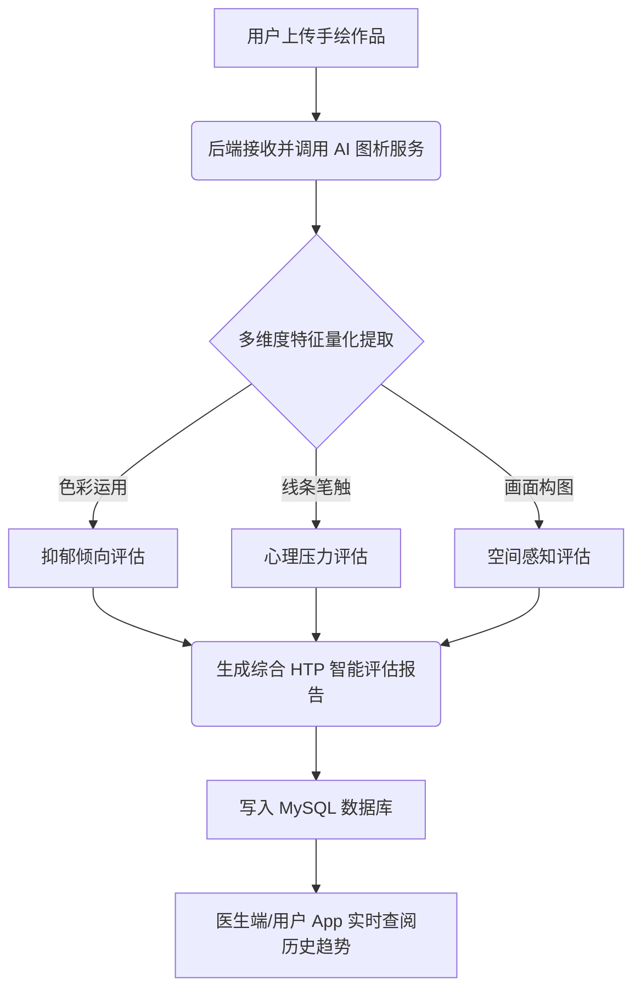
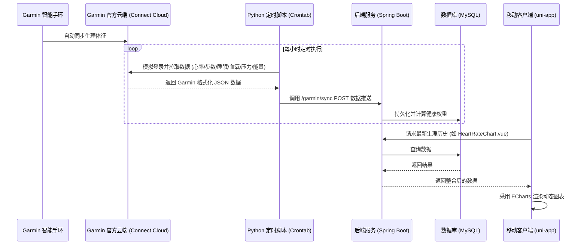
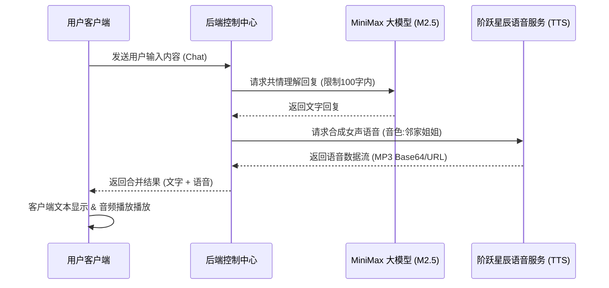

# 💖 心晴AI - 智能心理检测与管理平台宣传官网

<div align="center">

[](https://html.spec.whatwg.org/) [](https://www.w3.org/Style/CSS/) [](https://developer.mozilla.org/zh-CN/docs/Web/JavaScript) [](https://spring.io/) [](https://vuejs.org/) [](https://uniapp.dcloud.net.cn/) [](https://www.mysql.com/) [](https://www.python.org/) [](https://connect.garmin.com/) [](https://www.minimaxi.com/) [](https://www.stepfun.com/)

</div>

---

## 📋 项目简介

**心晴AI** 是一款融合了**智能穿戴手环生理数据**、**大语言模型共情聊天**、**多模态心理量表评估**、**房树人投射测试（HTP）**、**生态瞬时评估（EMA）**与**医生端后台管理**于一体的综合数字心理健康检测与情绪疗愈管理平台。

本子目录 `healthsystem-home` 是**心晴AI**项目的官方展示与宣传入口页，具有极致创新的 3D 拟态视觉冲击感：
*   **三维粒子交互背景**：基于 HTML5 Canvas 构建的 3D 浮动粒子网络星空，支持鼠标悬浮粒子推力排斥与光感呼吸律动。
*   **实机演示视频嵌入**：内置影院级超宽屏实机演示播放器，通过渐变微光边框与磨砂玻璃播放按钮展示系统全貌。
*   **3D 特色卡片轮播**：基于 Swiper 3D Coverflow 构建的可滑动、立体旋转的特色功能卡片。
*   **核心能力对比雷达**：利用 ECharts 雷达图将“心晴AI”、“传统量表”和“健康手环”进行多维度数据化可视化对比。
*   **玻璃拟态下载弹窗**：点击 "App下载" 会激活毛玻璃拟态弹窗，提供“心晴 App 本地下载”和“Garmin Connect 佳明手环连接同步客户端”的双向分流下载。

---

## 🛠️ 技术栈

整个 **心晴AI** 项目由官网、前端应用、后端服务和 AI 数据同步等部分组成，技术选型如下：

### 🖥️ 前端技术栈 (Front-End)

| 技术/框架 | 应用场景 | 特性与说明 |
|:---|:---|:---|
| **uni-app** | 跨平台移动端 (App / H5) | 实现 iOS、Android 及 Web 端的“一套代码，多端发布” |
| **Vue.js 2.x** | 移动端 & 数据交互核心 | 前端经典 MVVM 框架，驱动业务逻辑与组件状态 |
| **Vanilla HTML5 & CSS3** | 官网宣传页 (`index.html`) | 运用极简原生网页、CSS变量控制及高阶三维特效保证性能 |
| **Swiper 10.x** | 官网特色轮播图 | 驱动 Coverflow 3D 动态卡片立体翻转与触摸拖拽 |
| **ECharts** | 数据可视化大屏 & 雷达图 | 驱动医生端数据监控、用户报告趋势折线及官网雷达对比图 |
| **Layui & LayuiMini** | 医生与管理员 Web 后台 | 响应式后台管理系统框架，具有丰富的表格与菜单树 |
| **uView UI** | 移动端组件库 | 提供丰富的跨端 UI 组件支撑快速业务拼装 |

### ⚡ 后端技术栈 (Back-End)

| 技术/组件 | 应用场景 | 特性与说明 |
|:---|:---|:---|
| **Spring Boot 2.3.4** | 服务端核心基础框架 | 高效构建 RESTful API 服务，内置 Tomcat 容器 |
| **Apache Shiro 1.3.2** | 权限控制与身份认证 | 基于角色的细粒度拦截认证，保证医生/普通用户越权隔离 |
| **JWT (JSON Web Token)**| 安全 Token 机制 | 无状态请求状态维持，支持过期自动判定 |
| **MyBatis 2.1.3** | 数据持久层 (ORM) | 实现业务实体类与 MySQL 8.0 数据库表结构的高效交互映射 |
| **Druid 1.1.8** | 数据库连接池 | 阿里开源高性能连接池，内置 SQL 防注入防火墙及性能监控 |
| **极光推送 (JPush)** | 移动端消息异步推送 | 定时下发健康填报提醒、医生诊断通知，支持离线 7 天补发 |
| **ZXing 3.3.3** | 医患互通二维码生成 | 用于生成患者专用的 6 位数配对邀请码及专属绑定二维码 |
| **Knife4j / Swagger** | 接口可视化文档工具 | 自动反射生成 Swagger JSON，提供美观的排版与接口测试面板 |

### 🤖 智能 AI 与数据集成服务 (AI & Integration)

| 服务名称 | 应用场景 | 技术说明 |
|:---|:---|:---|
| **MiniMax M2.5** | AI 共情聊天助手 | 针对心理共情陪伴调优的大语言模型，对话长度控制在 100 字内以防冗长 |
| **StepAudio 2.5 TTS** | 智能语音伴护播报 | StepFun 阶跃星辰女声语音生成，支持防重叠异步中断及全局静音控制 |
| **HTP 房树人深度图析** | 绘画心理诊断与识别 | AI 对用户手绘上传的“房树人”图片进行色彩、笔触、构图多维度的特征量化并生成报告 |
| **Garmin Connect API** | 手环生理指标自动化同步 | 基于 Python 的 Garmin Connect API 数据抓取，定时 POST 同步至 MySQL |

---

## 📁 目录结构

系统包含宣传官网与主系统开发两大部分，其目录集成关系如下：

```
Mindapp/
├── healthsystem-home/               # 📂 三维动态官网宣传页与静态资源项目 (当前目录)
│   ├── index.html                  # 📄 官网主入口 (包含 3D 粒子、Swiper 卡片、ECharts 雷达图)
│   ├── logo.png                    # 🖼️ 心晴AI 官方Logo (全站Favicon/页眉页脚应用)
│   ├── vercel.json                 # ⚙️ Vercel 托管部署路由重写配置文件
│   └── 心晴AI-视频演示.mp4            # 🎥 产品全景实机演示展示视频
│
└── healthsystems/                   # 📂 核心业务开发主项目
    ├── database/                   # 🗄️ MySQL 数据库 SQL 初始化与备份脚本 (whole.sql)
    ├── python-garminconnect-master/# 🐍 佳明手环 API 数据抓取与推送集成脚本 (example_modify.py)
    ├── run_backend.ps1             # ⚡ 一键停止冲突进程并启动 Spring Boot 开发服务的脚本
    ├── deploy.ps1                  # 🚀 一键进行 Maven 编译打包、SCP 上传、SSH 进程重启的自动化部署脚本
    │
    ├── frontend/                   # 📱 移动端客户端项目 (uni-app / Vue2)
    │   ├── pages/                  # ├─ 页面目录
    │   │   ├── index/              # │  ├─ 客户端首页 (综合数据总览)
    │   │   ├── aiassess/           # │  ├─ AI 评估中心 (HTP绘画/自助量表/医生专业测评三 Tab)
    │   │   ├── heal/               # │  ├─ 疗愈空间 (AI共情对话/解压游戏/冥想音频/心情日记)
    │   │   └── mine/               # │  └─ 个人中心 (ECharts 雷达图综合评估报告、绑定设置)
    │   │   └── Scale/              # │  └─ 10+ 种量表答题页面 (含 SDS, SAS, SCL-90, OCEAN 等)
    │   └── static/                 # └─ 静态资源
    │
    └── healthsystem-backend6/      # 💻 Java 后端及 Layui 医生管理后台项目
        ├── src/main/java/          # ├─ Java 源码
        │   ├── controller/         # │  ├─ 控制器 (API 统一入口，如 Scale, Htp, GarminData, AiChat 等)
        │   ├── service/            # │  ├─ 业务服务层
        │   ├── mapper/             # │  ├─ MyBatis 数据库 Mapper 映射层
        │   └── shiro/              # │  └─ Shiro 权限架构与 JWT 鉴权过滤器
        ├── src/main/resources/     # ├─ 配置文件与模版静态文件
        │   ├── application.yml     # │  ├─ 主配置文件
        │   ├── static/             # │  ├─ 静态资源
        │   └── templates/page/     # │  └─ LayuiMini 医生端管理后台页面 (table_user, table_scale, table_htp等)
        └── pom.xml                 # └─ Maven 依赖管理配置文件
```

---

## ⚡ 核心功能模块和工作流程

### 1. 医患协同与绑定流程 🤝
普通用户在 App/H5 注册时，支持输入由医生在后台生成的 **6位数字邀请码** 进行绑定，或者使用摄像头扫描医生专属的**绑定二维码**（由 ZXing 渲染生成），实现医疗级别的数据互通，医生可在后台实时调阅分析。

### 2. 多模态 AI 心理评估流程 🎨
*   **量表评测优化**：系统支持 **SCL-90** (90题)、**大五人格** (60题)、**SDS** 等 10+ 专业量表，采用选项整行卡片点击选中，上一题/下一题跟随题目的交互优化。
*   **HTP 房树人手绘投射测验**：用户上传自己绘制的“房、树、人”画作，AI 在后台通过视觉网络提取构图、颜色和线条笔触特征，从 6 个维度生成智能心理诊断建议。



### 3. Garmin 智能手环数据同步流程 ⌚
基于 Python 集成组件，定时拉取 Garmin 智能手环的生理指标，推送给 Spring Boot 业务端进行大数据记录：



### 4. 情绪伴护与疗愈空间流程 💬
用户在“疗愈空间”与 AI 助手聊天，大模型（MiniMax M2.5）生成温暖共情的文字内容，后端对接 StepFun TTS 合成声音，在前端实现细腻自然的语音交互。



---

## ⚙️ 部署指南

### 🔧 数据库部署 (MySQL)
1. 创建数据库：
   ```sql
   CREATE DATABASE healthsystem_test2 CHARACTER SET utf8mb4 COLLATE utf8mb4_unicode_ci;
   ```
2. 运行导入脚本（目录位于 `healthsystems/database/healthsystem-whole.sql`）：
   ```bash
   mysql -u root -p healthsystem_test2 < healthsystems/database/healthsystem-whole.sql
   ```

### 💻 后端部署步骤 (Spring Boot)
在 Windows 环境下可利用根目录脚本进行快捷运行：
*   **本地开发一键启动**：
   ```powershell
   # 会自动检查并杀除端口冲突进程，然后通过 mvn spring-boot:run 启动后端服务
   ./run_backend.ps1
   ```
*   **云服务器一键自动打包部署**：
   ```powershell
   # 脚本自动进行 mvn clean package 打包，通过 SCP 传送至生产服务器并使用 SSH 登录 nohup 重新启动
   ./deploy.ps1
   ```
*   **端口与配置文件**：默认生产端口为 `1443` (支持 HTTPS SSL 加密)，开发配置文件位于 `application-default.yml`，生产环境配置文件位于 `application-deploy.yml`。

### 📱 前端客户端部署 (uni-app)
1. 使用 **HBuilderX** 导入 `healthsystems/frontend` 目录。
2. 编辑 `frontend/nxTemp/config/index.config.js` 配置 `baseUrl` 为你的后端部署域名。
3. 点击 HBuilderX 顶部菜单的 **“发行 -> 网站-H5手机版”** 编译输出静态页面，并将输出产物托管到 Web 服务器。
4. **Nginx 配置路由回退与跨域反代**：
   ```nginx
   server {
       listen 443 ssl;
       server_name yourdomain.com;
       root /var/www/health-h5/dist;
       index index.html;

       location / {
           try_files $uri $uri/ /index.html; # History 模式防 404
       }

       location /api/ {
           proxy_pass http://127.0.0.1:8081; # 反代指向后端服务
           proxy_set_header Host $host;
       }
   }
   ```

### ⌚ Garmin 同步组件配置 (Python)
1. 安装依赖包：
   ```bash
   cd healthsystems/python-garminconnect-master
   pip3 install -r requirements-dev.txt
   ```
2. 运行初始化生成本地缓存 Token 文件（防止多次请求被封 IP）：
   ```bash
   python3 example_modify.py
   # 根据控制台提示输入验证码进行 MFA 验证
   ```
3. 在系统中加入 Crontab 计划任务（如每小时执行一次）：
   ```bash
   0 * * * * cd /path/to/python-garminconnect-master && python3 example_modify.py >> sync.log 2>&1
   ```

---

## 📦 API 接口

### 🔐 基础鉴权与用户接口

| 接口端点 | 请求方法 | 接口描述 | 需要JWT认证 |
|:---|:---:|:---|:---:|
| `/user/login` | POST | 用户登录（返回 JWT Token） | ❌ 否 |
| `/user/register` | POST | 用户注册（支持邀请码） | ❌ 否 |
| `/user/info` | GET | 获取当前登录用户的详细档案 |  是 |
| `/user/updatePassword`| POST | 修改当前账号的用户密码 |  是 |

### ⌚ 手环生理数据同步接口

| 接口端点 | 请求方法 | 接口描述 | 需要JWT认证 |
|:---|:---:|:---|:---:|
| `/garmin/sync` | POST | 接收 Python 脚本同步推送上来的手环指标 |  是 |
| `/health/heartrate` | GET | 获取用户指定日期范围内的历史心率趋势 |  是 |
| `/health/sleep` | GET | 获取用户指定日期范围内的历史睡眠分期 |  是 |
| `/health/steps` | GET | 获取用户指定日期范围内的活动步数趋势 |  是 |
| `/health/spo2` | GET | 获取用户指定日期范围内的血氧饱和度变化 |  是 |
| `/health/stress` | GET | 获取用户指定日期范围内的生理压力曲线 |  是 |
| `/health/bodyBattery`| GET | 获取用户指定日期范围内的身体电量数值 |  是 |

### 📊 多模态评估与报告接口

| 接口端点 | 请求方法 | 接口描述 | 需要JWT认证 |
|:---|:---:|:---|:---:|
| `/scale/sds/questions`| GET | 获取 SDS 抑郁量表全量题目与选项结构 |  是 |
| `/scale/sds/submit` | POST | 提交答卷，后端实时根据常模评分判定风险 |  是 |
| `/scale/history` | GET | 分页获取当前用户的所有量表测试历史记录 |  是 |
| `/htp/list` | GET | 分页获取 HTP 房树人投射测试历史 (支持风险等级/日期过滤)|  是 |
| `/htp/detail/{id}` | GET | 获取单次 HTP 画作分析详情及 AI 多维图谱评估报告 |  是 |
| `/healthReport/getUserHealthDetail`| GET | 获取综合雷达图多维度综合评估得分及详细诊断 |  是 |

### 💬 疗愈与陪伴接口

| 接口端点 | 请求方法 | 接口描述 | 需要JWT认证 |
|:---|:---:|:---|:---:|
| `/aiChatAnalysis/getSessionList`| GET | 获取 AI 对话会话历史列表 |  是 |
| `/aiChatAnalysis/getSessionMessages`| GET | 获取某次 AI 聊天会话的完整共情聊天文字日志 |  是 |
| `/aiChatAnalysis/getEmotionStatistics`| GET | 统计用户与 AI 对话中流露出的情感状态趋势 |  是 |
| `/diaryAnalysis/getDiaryList` | GET | 分页调阅用户的疗愈日记列表 |  是 |

---

## 💡 总结与展望

### 🏆 核心成效总结
1.  **生理与心理多模态联合评估**：项目打破了传统心理医学与手环穿戴设备之间的信息壁垒，实现了“主观评测（量表）+ 客观生理（心率、睡眠、压力）+ 投射测试（房树人手绘）”的三位一体全面筛查模型。
2.  **共情陪伴的疗愈闭环**：结合了 MiniMax 情感认知大模型与 StepFun 柔和的女声语音合成技术，让系统不再是冰冷的数据记录器，而是一个随时倾听、能够发声的温情伴侣，构筑了“**筛查-评估-干预-疗愈**”的闭环健康体系。
3.  **高交互水准的 3D 视觉大屏**：官网宣传页采用 3D 卡片旋转及径向粒子画布技术，大大提升了系统在宣发层面的高级感，树立了项目前沿、极客与严谨并存的产品形象。

### 🚀 未来展望
*   **边缘计算表情抓取 (Work 2 & 3 演进)**：未来规划将接入摄像头微表情识别模型，通过 OpenCV/MediaPipe 实时捕获面部 Apex 帧（主观微表情情绪识别），结合 AU 编码进行大模型联合提示词（Prompt Learning）推理，提升瞬时情绪诊断的绝对精度。
*   **多设备厂商拓展**：进一步拓展除了佳明（Garmin）之外的国产智能穿戴设备（如华为、小米等）健康数据 API 的兼容性，降低普通用户手戴设备的体验门槛。
*   **更深度的医疗协同**：丰富医生端的统计报表，支持医生一键导出 SCL-90 报表及 HTP 绘画判定特征图谱至临床病例系统中，推动数字心理疗法的临床化演进。
